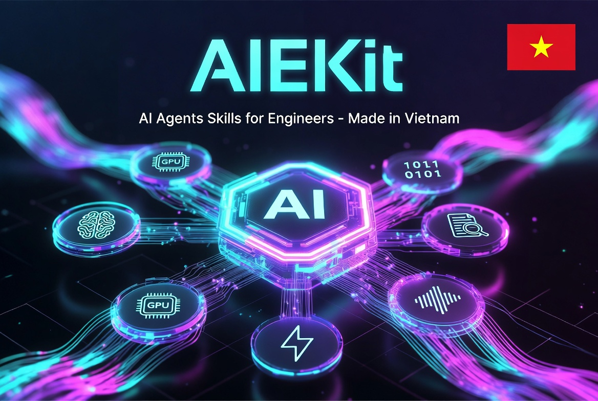

<p align="center">
  
</p>

<p align="center">
  <a href="#"></a>
  <a href="#"></a>
  <a href="#"></a>
  <a href="#"></a>
  <a href="#"></a>
  <a href="#"></a>
</p>

<p align="center">
  <a href="#"></a>
  <a href="#"></a>
  <a href="#"></a>
  <a href="#"></a>
  <a href="#"></a>
  <a href="#"></a>
</p>

<h1 align="center">AIE-Skills</h1>

<p align="center">
  Bộ Kiro Skills & Steering cho workflow AI/ML Engineering — từ setup Python project, fine-tune LLM, đến deploy inference server.
</p>

---

## Quickstart

### One-liner Install

```bash
# Install vào project hiện tại
curl -fsSL https://raw.githubusercontent.com/jayll1303/AIEKit/main/install.sh | bash

# Install vào thư mục cụ thể
curl -fsSL https://raw.githubusercontent.com/jayll1303/AIEKit/main/install.sh | bash -s -- /path/to/project

# Install globally (vào ~/.kiro/)
curl -fsSL https://raw.githubusercontent.com/jayll1303/AIEKit/main/install.sh | bash -s -- --global

# Include Powers (MCP integrations, disabled by default)
curl -fsSL https://raw.githubusercontent.com/jayll1303/AIEKit/main/install.sh | bash -s -- -p
```

Script chỉ copy components chưa tồn tại — không overwrite file đã có. Powers (MCP) không được cài mặc định.

### Smart Install (recommended)

Dùng skill `aie-skills-installer` trong Kiro — nó sẽ:

1. Scan codebase target (deps, imports, Dockerfiles, notebooks...)
2. Recommend chỉ skills có signal cụ thể từ project
3. Chờ user confirm trước khi cài
4. Cài selective + steering files tương ứng

### Manual Install

```bash
git clone https://github.com/jayll1303/AIEKit.git /tmp/aie-skills
bash /tmp/aie-skills/.kiro/install.sh
rm -rf /tmp/aie-skills
```

---

## Skills (28)

| Skill | Mô tả |
|-------|--------|
| `aie-skills-installer` | Analyze target project codebase và đề xuất chỉ cài skills cần thiết (tránh cài toàn bộ tốn context) |
| `arxiv-reader` | Đọc và phân tích paper arXiv qua HTML |
| `docker-gpu-setup` | Dockerfile & docker-compose cho GPU/CUDA workloads |
| `experiment-tracking` | Selfhosted experiment tracking với MLflow / W&B |
| `fastapi-at-scale` | Build production-grade FastAPI at scale: project structure, async SQLAlchemy, Alembic migrations, JWT auth, rate limiting, testing với httpx, deploy uvicorn/gunicorn/Docker |
| `freqtrade` | Phát triển crypto trading strategies với Freqtrade |
| `hf-hub-datasets` | Download, upload, stream models & datasets từ HuggingFace Hub |
| `hf-speech-to-speech-pipeline` | Architecture patterns cho huggingface/speech-to-speech queue-chained pipeline: STT/LLM/TTS handlers, VAD, progressive streaming |
| `hf-transformers-trainer` | Fine-tune & align LLMs với Trainer, TRL, PEFT (LoRA/QLoRA) |
| `k2-training-pipeline` | Train speech models với Next-gen Kaldi: k2 (FSA/FST loss), icefall (Zipformer/Conformer recipes), lhotse (data prep) |
| `llama-cpp-inference` | Chạy GGUF models locally với llama-server, llama-cli, llama-cpp-python (CPU+GPU) |
| `model-quantization` | Quantize LLMs với GGUF, GPTQ, AWQ, bitsandbytes |
| `notebook-workflows` | Tạo & chỉnh sửa Jupyter/Colab notebooks programmatically |
| `ollama-local-llm` | Chạy và quản lý local LLMs với Ollama: pull, run, Modelfile, REST API |
| `openai-audio-api` | Build OpenAI-compatible audio/speech APIs với FastAPI: concurrency control, dynamic batching, streaming synthesis, adapter pattern |
| `paddleocr` | OCR với PaddlePaddle: text detection, recognition, fine-tuning, dataset prep, PP-OCRv5, PP-StructureV3 |
| `python-ml-deps` | Cài ML deps với uv, xử lý CUDA version conflicts |
| `python-project-setup` | Bootstrap Python projects với uv, ruff, pytest |
| `python-quality-testing` | Type annotations, Hypothesis testing, mutation testing |
| `sglang-serving` | Serve LLMs với SGLang: RadixAttention prefix caching, structured output (JSON/regex/EBNF) |
| `sherpa-onnx` | Offline speech processing: ASR, TTS, VAD, speaker diarization, speech enhancement |
| `tensorrt-llm` | Optimize LLM inference với NVIDIA TensorRT-LLM: engine building, FP8/INT4, kernel fusion |
| `text-embeddings-inference` | Deploy embedding/reranker models với HuggingFace TEI |
| `text-embeddings-rag` | RAG pipelines với sentence-transformers, FAISS, ChromaDB, Qdrant |
| `triton-deployment` | Deploy models trên NVIDIA Triton Inference Server |
| `ultralytics-yolo` | Train, predict, export, deploy YOLO models (detect, segment, classify, pose, OBB) với Ultralytics |
| `unsloth-training` | Fine-tune LLMs 2x faster, 70% less VRAM với Unsloth: SFT/DPO/GRPO, export GGUF/vLLM |
| `vllm-tgi-inference` | Serve LLMs locally với vLLM hoặc TGI |

## Steering (6)

| File | Inclusion | Mô tả |
|------|-----------|--------|
| `kiro-component-creation.md` | `always` → `auto` khi install | Quy tắc tạo Steering, Skills, Hooks, Powers cho Kiro |
| `notebook-conventions.md` | `fileMatch` (`**/*.ipynb`) | Conventions khi làm việc với file `.ipynb` |
| `ml-training-workflow.md` | `auto` | Conventions cho ML training & fine-tuning workflows |
| `inference-deployment.md` | `auto` | Conventions cho model serving & deployment |
| `python-project-conventions.md` | `auto` | Conventions cho Python projects: uv, ruff, pytest, CUDA deps |
| `gpu-environment.md` | `fileMatch` (`Dockerfile*`, `docker-compose*`) | Conventions cho GPU Docker containers |

## Hooks (6)

| Hook | Event | Mô tả |
|------|-------|--------|
| `update-readme-index` | `fileEdited` | Auto-update README index khi edit component, commit + push (cần confirm) |
| `readme-index-on-create` | `fileCreated` | Auto-update README index khi tạo component mới, commit + push (cần confirm) |
| `readme-index-on-delete` | `fileDeleted` | Auto-update README index khi xóa component, commit + push (cần confirm) |
| `skill-quality-gate` | `fileCreated` | Check SKILL.md mới theo best practices + update interconnection map |
| `skill-quality-on-edit` | `fileEdited` | Check SKILL.md đã sửa theo best practices + interconnection map |
| `steering-consistency` | `fileCreated` | Check steering mới: frontmatter, domain overlap, cross-references |

## Powers (3) — Optional, not installed by default

Powers require MCP server auth/API keys. Install via `aie-skills-installer` skill or manual copy.
MCP servers ship `"disabled": true` — enable after configuring credentials.

| Power | MCP Server | Mô tả |
|-------|------------|--------|
| `power-huggingface` | [HF MCP Server](https://huggingface.co/mcp) (remote HTTP) | Search models, datasets, papers, spaces trên HuggingFace Hub. Compare models, check configs, discover trending papers |
| `power-gpu-monitor` | [mcp-system-monitor](https://github.com/huhabla/mcp-system-monitor) (local Python) | Monitor GPU/VRAM/CPU real-time, estimate memory cho ML models, diagnose OOM errors |
| `power-sentry` | [@sentry/mcp-server](https://github.com/getsentry/sentry-mcp) (local npx) | Integrate Sentry SDK cho error tracking, performance monitoring, debug production issues via MCP. Setup patterns cho JS, Python, React, Next.js, FastAPI |

Mỗi power bao gồm: `POWER.md` + `mcp.json` (disabled) + optional `steering/` workflows.
